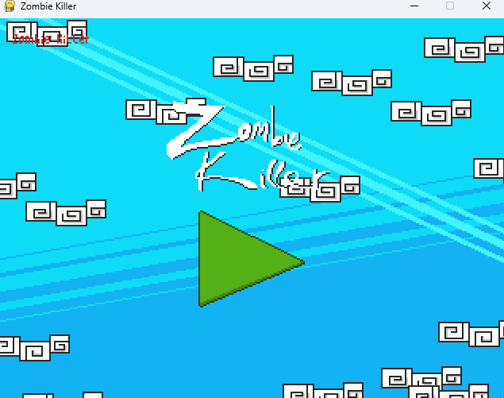
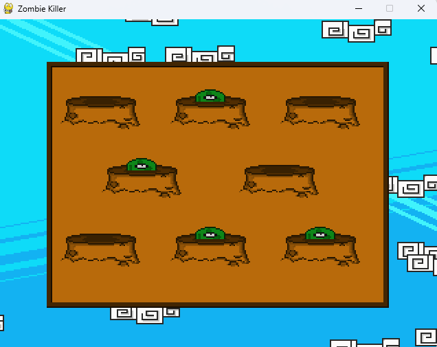

# TIM Adventure - Mario-like Game

TIM Adventure is a full-fledged Python game featuring exciting gameplay, a dynamic menu system, and an integrated map editor for endless creativity.




## Features

- **Platformer Gameplay**: Classic Mario-style platforming with enemies, power-ups, and bosses
- **Map Editor**: Create and customize game levels with visual editor
- **Particle Effects**: Dynamic visual effects for attacks and environmental interactions
- **Multiple Levels**: Progressive difficulty with unique boss battles
- **Sound System**: Background music and sound effects
- **Upgrade System**: Collect items to enhance player abilities

### Gameplay Demo
https://github.com/truongghieu/mario/assets/89084037/5e4c78d2-deb0-48f9-9377-2a3a1e9cbca3

### Editor Demo
https://github.com/truongghieu/mario/assets/89084037/8a80f609-3b1c-49c1-81af-f57723667be9

## Installation

1. Clone the repository:
```bash
git clone https://github.com/truongghieu/mario.git
cd mario
```

2. Install dependencies:
```bash
pip install -r requirements.txt
```

## Running the Game

To start the game:
```bash
python game.py
```

To start the map editor:
```bash
python editor.py
```

## Controls

### Game Controls
- **Arrow Keys**: Move character
- **Space**: Jump
- **Z**: Attack/Shoot
- **X**: Special ability
- **P**: Pause game

### Editor Controls
- **Left Click**: Place tiles
- **Right Click**: Remove tiles
- **Number Keys**: Select tile type
- **S**: Save map
- **L**: Load map

## Project Structure

```
mario/
├── data/               # Game assets (sounds, images, fonts)
├── img_show/           # Screenshots and demo videos
├── map/                # Game level files
├── scripts/            # Game source code
│   ├── boss/           # Boss enemy implementations
│   ├── system/         # Core systems (entities, tilemap, utils)
│   ├── base.py         # Base game class
│   ├── bullet.py       # Projectile system
│   ├── enemy.py        # Enemy behaviors
│   ├── game.py         # Main game entry point
│   ├── editor.py       # Map editor
│   └── player.py       # Player controller
├── requirements.txt    # Python dependencies
└── README.md           # This document
```

## Dependencies

- Python 3.7+
- Pygame
- PyTMX (for tilemap loading)

Full list in [requirements.txt](requirements.txt)

## Contributing

Contributions are welcome! Please follow these steps:

1. Fork the project
2. Create your feature branch (`git checkout -b feature/AmazingFeature`)
3. Commit your changes (`git commit -m 'Add some AmazingFeature'`)
4. Push to the branch (`git push origin feature/AmazingFeature`)
5. Open a Pull Request

## Acknowledgements

- **VEXED Free Asset**: [Paper Pixel assets](https://v3x3d.itch.io/paper-pixels)
- **Slider Implementation**: [YouTube tutorial](https://www.youtube.com/watch?v=n_ijgqYmXS0)
- **Game Development Core**: [YouTube series](https://www.youtube.com/watch?v=2gABYM5M0ww&t=15115s)

## License

This project is licensed under the [MIT License](LICENSE).

---

Happy gaming! 🎮
